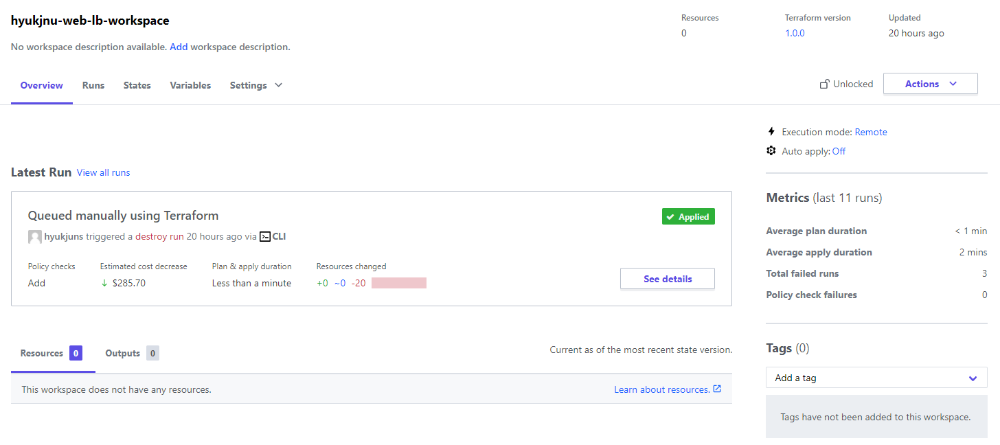
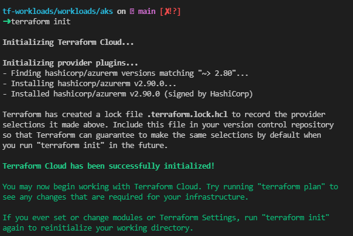
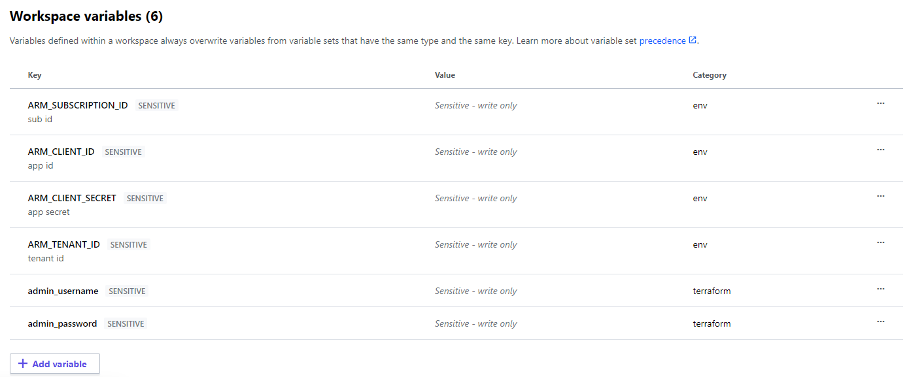
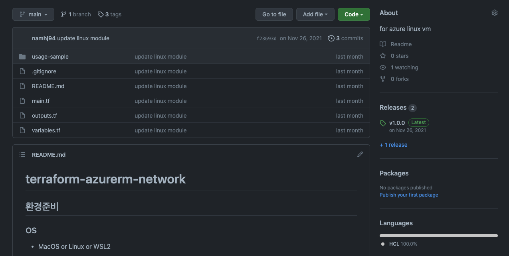
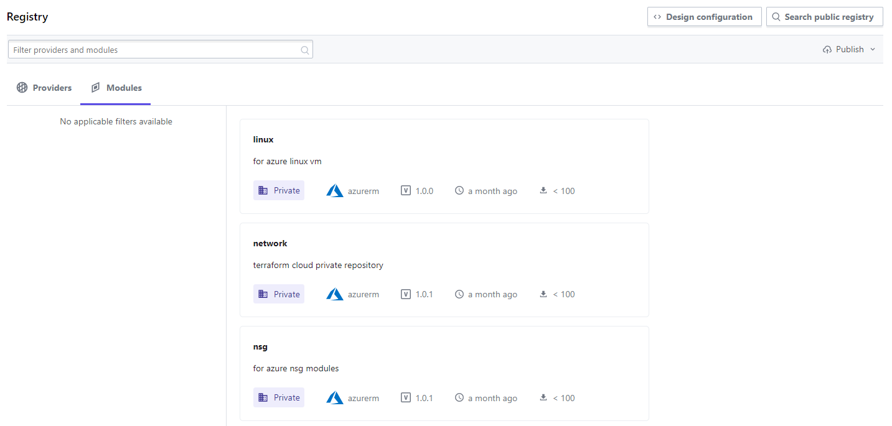

# Terraform Cloud



## Overview

모든 규모의 환경에서 Terraform 협업을 위한 Cloud Platform

- Cloud환경에서 Terraform의 실행을 동시 확인 및 승인
- Terraform 실행시 필요한 클라우드 자격증명을 Cloud에서 중앙관리
- tfstate의 자동 업데이트와 누적으로 히스토리 파악 가능
- 정책을 통해 Apply 제어, VCS 연동을 통해 gitOps 구현
- workspace단위로 환경별 workloads 관리
- 조직 내 RBAC을 사용한 Terraform에 대한 권한 관리

## Prequisites

- Local Terraform Engine
- VSCode Editor
- Terraform Cloud Account
- Vendor IAM
    - Azure Service Principal
        
        ```bash
        az login
        az account list
        az account set --subscription <SUBSCRIPTION_ID>
        az ad sp create-for-rbac --name <CUSTOM_NAME> --role="Contributor" --scopes="/subscriptions/SUBSCRIPTION_ID"
        ```
        

## Set-up (CLI-Driven)

### 1. Create Workspace

- UI or Code 중 자유롭게 사용
    1. UI
        1. Terraform Cloud에서 Workspace 생성
            - type
                - VCS-driven: Source repository를 연결하여 gitOps 구현
                - CLI-driven: local 사용과 동일한 workflow
                - API-driven: tfc api를 사용한 programming workflow
        2. .tf 파일에 workspace 정보 삽입 (CLI-driven 기준)
            
            ```bash
            terraform {
              cloud {
                organization = "ORGNAME"
            
                workspaces {
                  name = "WORKSPACENAME"
                }
              }
            }
            ```
            
    2. Code
        1. Code에 선언 후 Init 시 workspace 자동 생성
        - CLI-driven
            
            ```bash
            terraform {
              cloud {
                organization = "ORGNAME"
            
                workspaces {
                  name = "WORKSPACENAME"
                }
              }
            }
            ```
            

### 2. Configure Workspace

IAM, Excution Mode, Terraform Version, Remote state sharing

1.  IAM 구성
    - Workspace에서 사용될 Cloud에 대한 자격 증명 변수 구성
        - Scope: Workspace
        - Type: Environment
    - Azure Service Principal
        
        ```bash
        ARM_SUBSCRIPTION_ID
        ARM_CLIENT_ID
        ARM_CLIENT_SECRET
        ARM_TENANT_ID
        ```
        
2. Execution Mode 선택
    - Remote(Default)
    - Local
    - Agent
3. Teraform Version 선택
    1. Excution Mode가 Remote일 경우 Terraform Cloud에서 사용될 Terraform Version 선택
4. [옵션] Remote state sharing
    1. 조직 내 workspace를 대상으로 state file을 공유할 workspace 선택
        1. globally
        2. specific workspace

### 3. Login & .tf

- Local Shell에서 terraform login
    - terraform login시 Terraform Cloud에서 Token 발급 및 입력
        
        ```bash
        terraform login
        ...
        Token for app.terraform.io:
          Enter a value:
        ```
        
    - 입력된 token은 local의 /home/USERNAME/.terraform.d/credential.tfrc.json에 저장
        
        ```bash
        cat ~/.terraform.d/credentials.tfrc.json
        {
          "credentials": {
            "app.terraform.io": {
              "token": "TOKEN"
            }
          }
        }
        ```
        
- .tf 구성 및 사용
    1. .tf file
        
        ```bash
        terraform {
          required_providers {
            azurerm = {
              source  = "hashicorp/azurerm"
              version = "~> 2.80"
            }
          }
          backend "remote" {
            organization = "ORGNAME"
        
            workspaces {
              name = "WORKSPACENAME"
            }
          }
        }
        provider "azurerm" {
          features {}
        }
        ...
        ```
        
    2. init & plan & apply
        
        ```bash
        terraform init
        terraform plan
        terraform apply
        ```
        
        

        

## Features

### Terraform Cloud Migration

Local Terraform directory → Terraform Cloud Workspace

1. terraform login
2. Backend Block 추가
    
    ```bash
    terraform {
      cloud {
        organization = "ORGNAME"
    
        workspaces {
          name = "WORKSPACENAME"
        }
      }
    }
    ```
    
3. terraform init
    - 현재 상태파일(Local의 tfstate)을 Terraform Cloud로 Migration
4. [옵션] local의 terraform.tfstate 파일 제거

### VCS Connection (VCS-Driven)

github과 같은 VCS를 연결하여 gitOps 구현

- Set- up
    - Terraform Cloud의 UI 구성
        - [신규] Create Workspace or [기존] Workspace → Settings → Version Control
        - VCS-driven type
        - VCS Provider
            - github
            - gitlab
            - bitbucket
            - azure devops(repos)
        - 조직(Org) 수준 설정
            - Terraform Cloud의 Oauth Application or Application 등록 및 연결
                
                [GitHub.com (OAuth) - VCS Providers - Terraform Cloud and Terraform Enterprise | Terraform by HashiCorp](https://www.terraform.io/cloud-docs/vcs/github)
                
            - Github Oauth Application
                - github 전체 repo
                - Github.com -> (User)Settings -> Developer settings -> OAuth Apps
            - Github Application
                - github 특정 repo
                - [Github.com](http://github.com/) -> (User)Settings -> Application
- gitOps Workflow
    1. Write .tf
    2. Git push
    3. Review
    4. Merge
    5. Auto trigger in Terraform Cloud
        1. plan & apply

### Terraform Working Directory

VCS 연결시 Terraform이 실행될 VCS directory path 지정 가능

### Remote State

workspace간의 statefile 참조

Remote state 참조 방식 (A workspace → B workspace)

- A workspace
    - 참조에 사용할 수 있도록 output 선언
        
        ```bash
        output "subnet_dev_01_id" {
          value = module.network.subnet_id
        }
        ```
        
- B workspace
    - data block으로 A의 output 참조
        
        ```bash
        # network workspace 
        data "terraform_remote_state" "network" {
          backend = "remote"
          config = {
            organization = "ORGNAME"
            workspaces = {
              name = "WORKSPACENAME"
            }
          }
        }
        
        ...
        subnet_id                     = data.terraform_remote_state.network.outputs.subnet_dev_01_id
        ...
        ```
        

### Remote Variables

원격 실행 시 tfvars 사용 방법

1. local
    - Naming 변경: terraform.tfvars → *.auto.tfvars
    - Terraform Cloud는 local에 존재하는 *.auto.tfvars 파일을 자동으로 읽습니다.
2. remote
    - Terraform Cloud 상의 variables에 선언
        
        
        

### Execution Mode

Terraform 실행 환경을 Local 혹은 Cloud로 지정 가능

- remote
    - Terraform Cloud에서 Terraform을 실행
    - 협업 용이, Terraform Cloud에서 실행에 대한 리뷰
    - Terraform Version은 Terraform Cloud 기준
- local
    - Local Machine에서 Terraform 실행
    - Terraform Version은 Local 기준
    - Terraform Cloud는 tfstate만 동기화
- Agent
    - 폐쇄망 환경에서 Agent를 사용하여 프로비전

### Private Registry

- 기업 or 팀 내부적으로 사용하는 Terraform Module을 Private Registry에서 등록 및 버전 관리
- github에서 모듈 소스를 관리하며, Tag로 버전을 관리함
- module repo
    
    
    
- module registry
    
    
    

## Ref.

- Tutorial
    
    [Get Started - Terraform Cloud | Terraform - HashiCorp Learn](https://learn.hashicorp.com/collections/terraform/cloud-get-started?utm_source=terraform_io)
    
- Terraform Cloud Docs
    
    [Home - Terraform Cloud and Terraform Enterprise | Terraform by HashiCorp](https://www.terraform.io/cloud-docs)